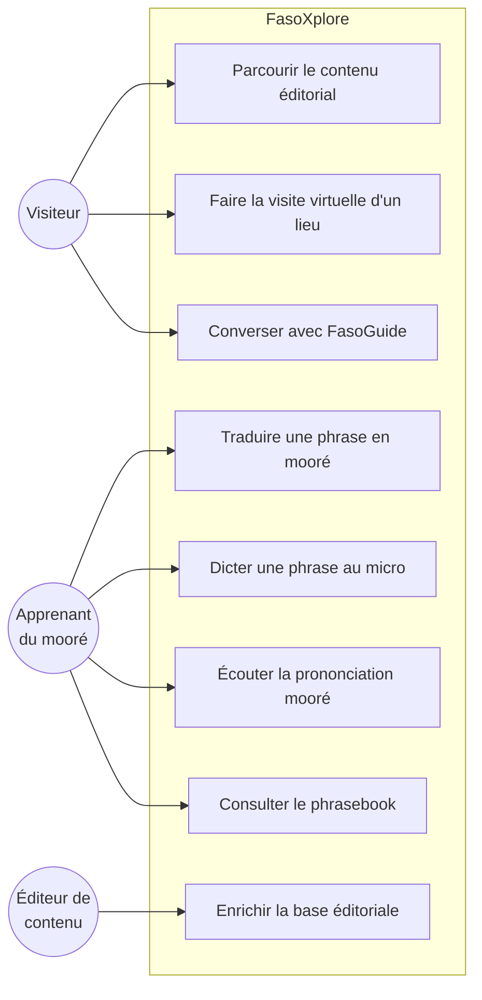
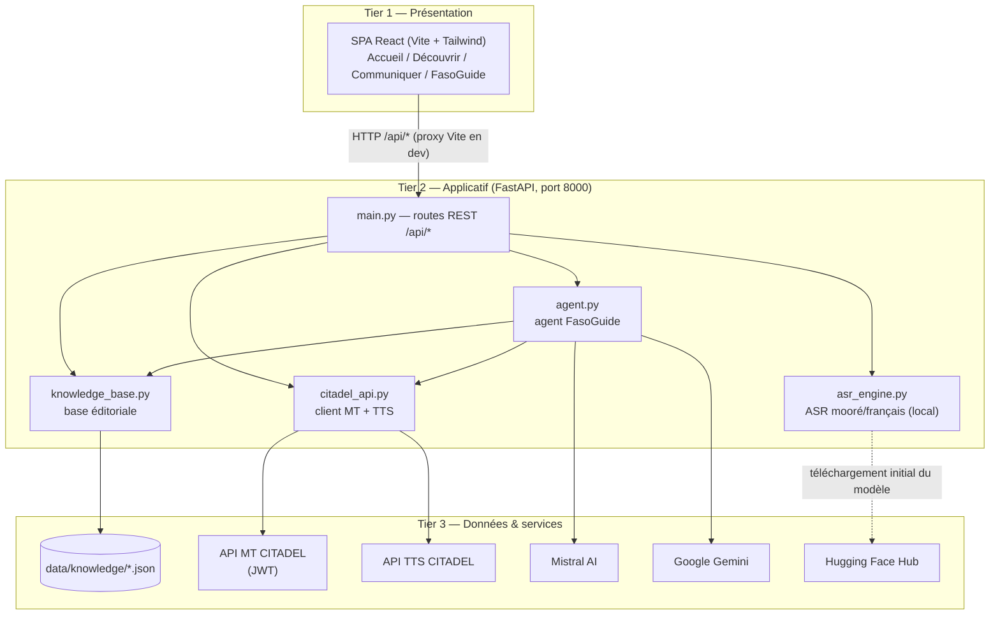
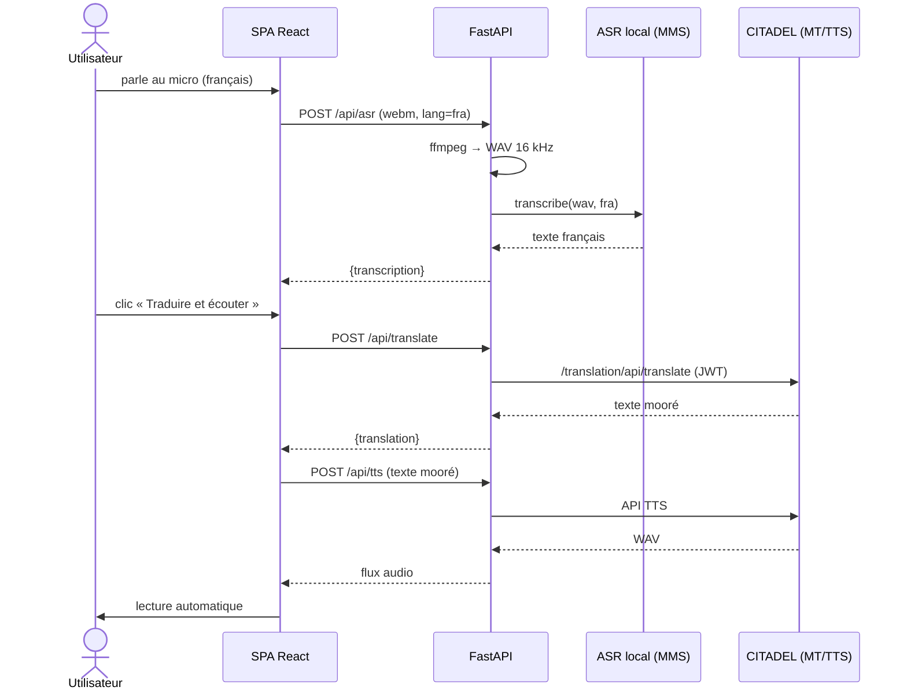
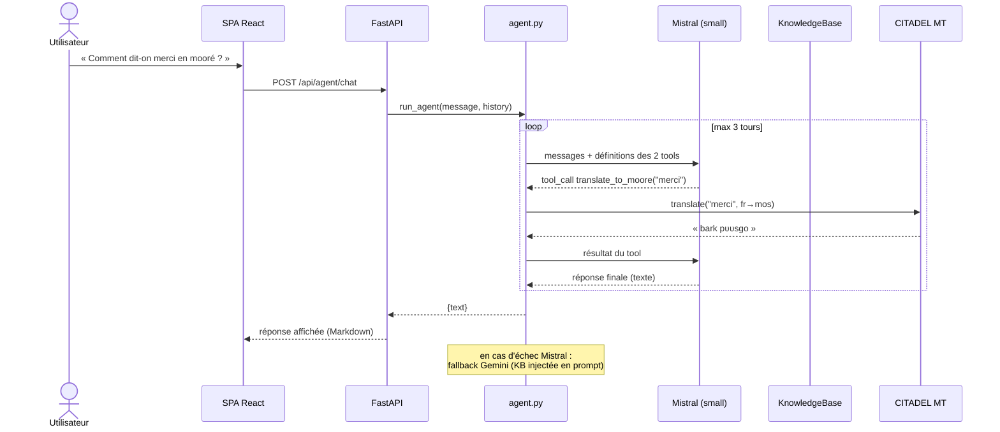
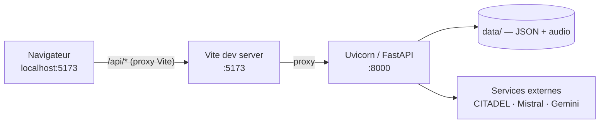
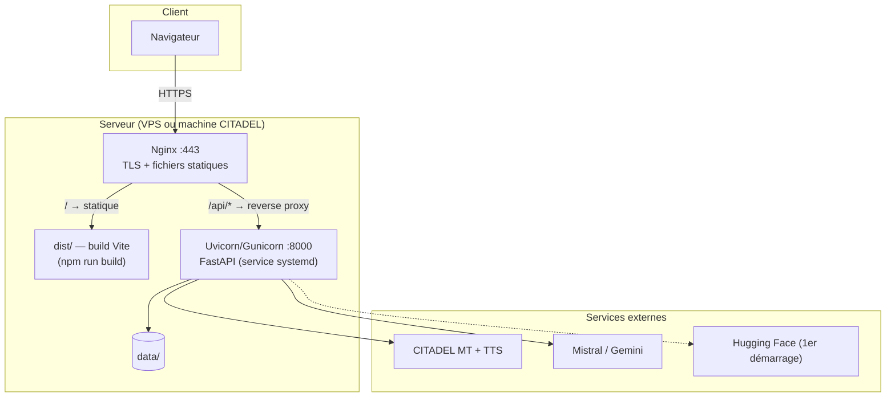

# FasoXplore — Documentation technique et fonctionnelle

> Plateforme de découverte du Burkina Faso : histoire, culture, patrimoine et
> langues nationales, avec des outils de traitement automatique du langage
> (NLP) souverains pour le mooré.
>
> Projet développé à CITADEL, Ouagadougou — 2026.

---

## Table des matières

1. [Présentation et objectifs](#1-présentation-et-objectifs)
2. [Acteurs](#2-acteurs)
3. [Besoins fonctionnels](#3-besoins-fonctionnels)
4. [Besoins non fonctionnels](#4-besoins-non-fonctionnels)
5. [Conception architecturale](#5-conception-architecturale)
6. [Conception détaillée](#6-conception-détaillée)
7. [Choix des outils](#7-choix-des-outils)
8. [Implémentation](#8-implémentation)
9. [Architecture de déploiement](#9-architecture-de-déploiement)
10. [Limites et perspectives](#10-limites-et-perspectives)

---

## 1. Présentation et objectifs

### 1.1 Contexte

Le Burkina Faso compte plus de 60 langues nationales. Le mooré, langue des
Mossi, est parlé par plus de 8 millions de locuteurs, mais reste très peu
doté en ressources numériques : peu de contenus en ligne, pas d'outils
grand public de traduction ou de reconnaissance vocale. Parallèlement, le
patrimoine historique et culturel du pays (royaumes mossi, architecture
kassena, FESPACO, sites naturels) est peu visible sur le web.

### 1.2 Objectifs

| # | Objectif | Mesure de succès |
|---|----------|------------------|
| O1 | Valoriser le patrimoine burkinabè auprès du grand public | Base éditoriale couvrant 5 catégories (histoire, lieux, culture, gastronomie, festivals) accessible en 2 clics |
| O2 | Rendre le mooré accessible aux non-locuteurs | Boucle complète voix française → texte mooré → audio mooré fonctionnelle |
| O3 | Démontrer la faisabilité d'un NLP souverain pour une langue peu dotée | Modèle ASR mooré fine-tuné localement, WER de 13,7 % |
| O4 | Offrir une expérience conversationnelle libre sur le Burkina | Agent IA capable d'interroger la base éditoriale et l'API de traduction de façon autonome |
| O5 | Produire un artefact utilisable, pas seulement une démo | Interface responsive, en français, tolérante aux pannes des services externes |

### 1.3 Périmètre

**Dans le périmètre** : site web public (4 modules), API backend, modèle ASR
mooré, intégration des API CITADEL (traduction et synthèse vocale), agent
conversationnel.

**Hors périmètre** : comptes utilisateurs, contenu contributif, application
mobile native, autres langues nationales que le mooré (extension future).

---

## 2. Acteurs

### 2.1 Acteurs humains

| Acteur | Description | Interactions principales |
|--------|-------------|--------------------------|
| **Visiteur curieux** | Grand public (Burkinabè, diaspora, étrangers) voulant découvrir le pays | Navigation éditoriale, visite virtuelle des lieux, questions à FasoGuide |
| **Apprenant du mooré** | Personne souhaitant communiquer en mooré (voyageur, membre de la diaspora) | Traduction vocale/écrite, écoute des prononciations, phrasebook |
| **Éditeur de contenu** | Membre de l'équipe enrichissant la base éditoriale | Édition des fichiers JSON de `data/knowledge/` (pas d'interface d'administration : la base est versionnée avec le code) |

### 2.2 Systèmes externes

| Système | Rôle | Mode d'accès |
|---------|------|--------------|
| **API MT CITADEL** | Traduction texte français ↔ mooré | REST + authentification JWT (`playground.citadel.bf`) |
| **API TTS CITADEL** | Synthèse vocale mooré (texte → WAV) | REST (URL configurable, actuellement exposée via ngrok) |
| **Mistral AI** | Modèle de langage principal de l'agent (function calling) | SDK `mistralai`, clé API |
| **Google Gemini** | Modèle de secours de l'agent | SDK `google-generativeai`, clé API |
| **Hugging Face Hub** | Distribution du modèle ASR fine-tuné (`Uriath/mms-mos-finetuned`) | Téléchargement au premier démarrage |

### 2.3 Diagramme de cas d'utilisation



---

## 3. Besoins fonctionnels

### Module Découvrir

| Réf. | Besoin | Détail |
|------|--------|--------|
| BF-01 | Consulter le contenu éditorial par catégorie | 5 onglets : histoire, lieux, culture, gastronomie, festivals ; cartes riches (description, incontournables, conseils, tags) |
| BF-02 | Illustrer les lieux | Chaque lieu affiche une photographie réelle |
| BF-03 | Visite virtuelle immersive | Expérience plein écran par lieu : image animée (effet Ken Burns), 3 scènes narratives (titre, description, conseil local), navigation entre lieux, fermeture par Échap |
| BF-04 | Passerelle vers l'agent | Depuis la visite virtuelle et sous chaque catégorie, un bouton ouvre FasoGuide avec une question préremplie |

### Module Communiquer

| Réf. | Besoin | Détail |
|------|--------|--------|
| BF-05 | Traduire du français vers le mooré | Saisie texte ou dictée vocale, traduction via l'API CITADEL |
| BF-06 | Dicter au micro | Enregistrement navigateur (MediaRecorder), transcription par le modèle ASR local |
| BF-07 | Écouter la traduction | Synthèse vocale mooré avec lecture automatique, puis relecture/pause à la demande |
| BF-08 | Phrases essentielles | 3 salutations mooré tirées aléatoirement du phrasebook (français, mooré, romanisation) |

### Module FasoGuide (agent conversationnel)

| Réf. | Besoin | Détail |
|------|--------|--------|
| BF-09 | Converser librement | Chat en français sur l'histoire, la culture, les lieux, les langues |
| BF-10 | Réponses ancrées dans la base | L'agent interroge la base éditoriale (tool `search_burkina_info`) avant de répondre à une question factuelle ; il ne doit pas inventer |
| BF-11 | Traduction à la demande | L'agent appelle le tool `translate_to_moore` quand l'utilisateur demande « comment dit-on … en mooré » |
| BF-12 | Question vocale | L'utilisateur peut poser sa question au micro, en français ou en mooré (sélecteur FR/MO) |
| BF-13 | Continuité de service | Si le modèle principal échoue, un modèle de secours répond ; si les deux échouent, message d'indisponibilité clair en français |

### Transverse

| Réf. | Besoin | Détail |
|------|--------|--------|
| BF-14 | API de santé | `GET /api/health` expose l'état du service |

---

## 4. Besoins non fonctionnels

| Réf. | Catégorie | Exigence | Réalisation |
|------|-----------|----------|-------------|
| BNF-01 | **Souveraineté** | Le traitement de la parole mooré ne dépend d'aucun service étranger | ASR exécuté localement (modèle MMS fine-tuné maison) ; traduction et TTS fournis par CITADEL (Burkina Faso) |
| BNF-02 | **Disponibilité** | Aucune panne d'un service externe ne doit rendre la plateforme muette | Agent à double modèle (Mistral → Gemini) ; phrasebook avec valeurs de repli ; TTS en échec = texte affiché quand même |
| BNF-03 | **Performance** | Navigation fluide, modèles chargés une seule fois | Modèle ASR et clients API instanciés au démarrage du serveur ; cache frontend des catégories éditoriales |
| BNF-04 | **Confidentialité** | Aucune donnée utilisateur persistante | Pas de base de données, pas de comptes ; fichiers audio traités dans des fichiers temporaires supprimés après usage |
| BNF-05 | **Sécurité** | Les secrets ne sont jamais dans le code | Clés et identifiants dans `.env` (gabarit `.env.example`) ; CORS restreint aux origines du frontend |
| BNF-06 | **Utilisabilité** | Interface en français, sans jargon technique visible | Textes 100 % français ; aucun terme technique (WER, ASR, modèles) exposé à l'utilisateur final |
| BNF-07 | **Accessibilité / responsive** | Utilisable du mobile au grand écran | Approche mobile-first (breakpoints Tailwind sm/md/lg), attributs ARIA sur les composants interactifs, icônes vectorielles |
| BNF-08 | **Identité visuelle** | Design ancré dans la culture burkinabè | Palette inspirée des matériaux du pays (indigo, or du Sahel, argile, vert mil), séparateurs au motif bogolan, typographies dédiées |
| BNF-09 | **Maintenabilité** | Design tokens centralisés, contenu séparé du code | Variables CSS uniques (`index.css`), contenu éditorial en JSON éditable sans toucher au code |
| BNF-10 | **Portabilité** | Installation simple sur un poste de développement | `npm install` + `pip install -r requirements.txt` ; ffmpeg embarqué via `imageio-ffmpeg` si absent du système |

---

## 5. Conception architecturale

### 5.1 Vue d'ensemble — architecture 3-tiers

La plateforme suit une **architecture 3-tiers** :

1. **Tier présentation** — SPA React servie au navigateur ;
2. **Tier applicatif** — API FastAPI qui orchestre les traitements
   (ASR local, appels aux services externes, agent, base éditoriale) ;
3. **Tier données et services** — fichiers JSON/audio versionnés d'une part,
   services distants (CITADEL, Mistral, Gemini) d'autre part.

Il n'y a **pas de base de données** : le tier données est constitué de
fichiers plats (choix assumé, cf. BNF-04 et §7).



### 5.2 Principes directeurs

- **Le frontend ne parle jamais aux services externes** : toutes les clés et
  authentifications vivent côté serveur ; le navigateur ne voit que `/api/*`.
- **Dégradation gracieuse à chaque étage** : chaque dépendance externe a un
  comportement de repli défini (fallback de modèle, texte sans audio,
  contenus par défaut).
- **Le contenu est de la donnée, pas du code** : enrichir la plateforme se
  fait en éditant des JSON, sans redéploiement du frontend.
- **Un seul point d'entrée backend** (`main.py`) qui délègue à des modules
  spécialisés à responsabilité unique.

---

## 6. Conception détaillée

### 6.1 Backend — modules

| Module | Responsabilité | Points de conception |
|--------|----------------|----------------------|
| `main.py` | Routes REST, conversion audio (ffmpeg → WAV mono 16 kHz), cycle de vie des modèles | Modèles chargés une fois au démarrage ; fichiers temporaires nettoyés en `finally` |
| `src/asr_engine.py` | Transcription parole → texte (mooré et français) | `facebook/mms-1b-all` + surcharge des poids par l'adaptateur fine-tuné `Uriath/mms-mos-finetuned` ; bascule d'adaptateur selon la langue |
| `src/citadel_api.py` | Client des API CITADEL | Gestion du token JWT (login + renouvellement automatique) ; URL TTS configurable (`CITADEL_TTS_URL`) |
| `src/agent.py` | Agent FasoGuide | Boucle agentique à function calling (détail §8.2) |
| `src/knowledge_base.py` | Chargement et interrogation des JSON éditoriaux | Recherche par sous-chaîne, filtrage du phrasebook par situation |

### 6.2 API REST

| Méthode | Route | Entrée | Sortie |
|---------|-------|--------|--------|
| GET | `/api/health` | — | État du service |
| POST | `/api/asr` | `multipart` : fichier audio + `lang` (`mos`/`fra`) | `{transcription, lang}` |
| POST | `/api/translate` | `{text, source_lang, target_lang}` | `{translation, source, target}` |
| POST | `/api/tts` | `{text}` (mooré) | Flux WAV |
| GET | `/api/phrasebook?situation=…` | Paramètre `situation` | `{situation, phrases[]}` |
| GET | `/api/knowledge/{categorie}` | Catégorie dans l'URL | Liste d'entrées éditoriales |
| POST | `/api/agent/chat` | `{message, history[]}` | `{text, audio_path}` |

### 6.3 Frontend — structure

```
frontend/src/
├── App.jsx                  # Routage (React Router)
├── index.css                # Design tokens : couleurs, polices, composants CSS
├── assets/                  # Photos des lieux, logo, index.js (mapping lieu → image)
├── pages/
│   ├── Home.jsx             # Hero + stats + cartes modules + citation
│   ├── Decouvrir.jsx        # Onglets par catégorie, cartes, visite virtuelle
│   ├── Communiquer.jsx      # Immersion voix→mooré + phrases essentielles
│   └── FasoGuide.jsx        # Chat agent (texte + micro FR/MO)
└── components/
    ├── layout/  (Navbar, Footer)
    └── ui/      (BogolonDivider, RevealOnScroll, VirtualVisit)
```

| Élément de conception | Détail |
|----------------------|--------|
| **Routage** | 4 routes : `/`, `/decouvrir`, `/communiquer`, `/fasoquide` |
| **Design tokens** | Toutes les couleurs/typos en variables CSS dans `index.css` — aucune couleur codée en dur dans les composants |
| **État** | État local React (`useState`/`useEffect`) — pas de store global, la complexité ne le justifie pas |
| **Cache éditorial** | Les catégories déjà consultées sont mémorisées au niveau module (pas de rechargement au changement d'onglet) |
| **Passage inter-pages** | La visite virtuelle et Découvrir transmettent une question préremplie à FasoGuide via l'état de navigation de React Router |
| **Animations** | Framer Motion exclusivement (transitions de pages, stagger, Ken Burns) |
| **Icônes** | Lucide React exclusivement — aucun émoji dans l'interface |

### 6.4 Modèle de données éditorial

Fichiers dans `data/knowledge/` (un par catégorie) :

```jsonc
// lieux.json — extrait
{
  "id": "tiebelé",
  "nom": "Tiébélé",
  "type": "village",
  "region": "Centre-Sud",
  "description": "…",
  "incontournables": ["Cour royale peinte", "…"],
  "meilleur_moment": "Octobre à Février …",
  "conseil": "…",
  "tags": ["art", "architecture", "Kassena"]
}

// phrasebook.json — extrait
{
  "situation": "salutations",
  "francais": "Bonjour / Comment allez-vous ?",
  "moore": "Laafi bala ?",
  "romanisation": "La-a-fi ba-la",
  "contexte": "Salutation universelle mooré"
}
```

Les images des lieux sont associées côté frontend par un mapping
`id du lieu → image importée` (`assets/index.js`), ce qui garde les JSON
indépendants du bundler.

### 6.5 Diagrammes de séquence

**Boucle d'immersion (Communiquer)** :



**Agent FasoGuide (function calling)** :



---

## 7. Choix des outils

### 7.1 Frontend

| Outil | Version | Justification |
|-------|---------|---------------|
| **React** | 18 | Écosystème dominant, composition par composants adaptée aux cartes/onglets/overlays du projet |
| **Vite** | 8 | Démarrage instantané, proxy `/api` intégré (pas de config CORS en dev), bundling des images |
| **Tailwind CSS** | 3 | Prototypage rapide ; combiné à des variables CSS maison pour garder une palette contrôlée |
| **Framer Motion** | 11 | Animations déclaratives (Ken Burns, stagger, transitions d'onglets) sans keyframes manuels |
| **React Router** | 6 | Routage SPA + passage d'état entre pages (question préremplie) |
| **Lucide React** | — | Icônes vectorielles cohérentes, remplace tout usage d'émojis |
| **react-markdown** | 10 | Rendu sûr des réponses Markdown de l'agent |

### 7.2 Backend

| Outil | Justification |
|-------|---------------|
| **FastAPI + Uvicorn** | API async performante, validation Pydantic, upload multipart natif, documentation OpenAPI automatique |
| **PyTorch + Transformers** | Exécution locale du modèle MMS ; `load_adapter` natif pour les adaptateurs de langue |
| **imageio-ffmpeg** | Binaire ffmpeg embarqué : conversion audio sans dépendance système |
| **python-dotenv** | Secrets hors du code |

### 7.3 Modèles et services d'IA

| Besoin | Choix | Justification |
|--------|-------|---------------|
| ASR mooré | `facebook/mms-1b-all` + adaptateur fine-tuné maison (PEFT, ~2M paramètres entraînés) | Seule voie réaliste pour une langue peu dotée : partir d'un modèle massivement multilingue et n'entraîner qu'un adaptateur ; WER final 13,7 % ; exécution locale = souveraineté |
| Traduction fr ↔ mooré | API MT CITADEL | Service burkinabè spécialisé sur les langues nationales — meilleure qualité que les traducteurs généralistes qui ne couvrent pas le mooré |
| Synthèse vocale mooré | API TTS CITADEL | Idem : aucune alternative grand public ne produit du mooré naturel |
| Agent conversationnel | `mistral-small-latest` (principal), `gemini-1.5-flash` (secours) | Function calling natif chez Mistral pour une vraie boucle agentique ; coût faible ; le fallback garantit la continuité de service (BF-13) |

### 7.4 Alternatives écartées

| Alternative | Raison du rejet |
|-------------|-----------------|
| Base de données (PostgreSQL, SQLite) | Aucune donnée utilisateur à persister ; le contenu éditorial versionné en JSON est plus simple à relire et enrichir |
| Détection d'intention par mots-clés dans l'agent | Fragile et non généralisable ; remplacée par du function calling où le modèle décide lui-même des outils à appeler |
| API ASR CITADEL | Remplacée par le modèle local fine-tuné : meilleure précision mesurée et indépendance réseau |
| Store global frontend (Redux, Zustand) | La complexité de l'état ne le justifie pas ; l'état local + un cache module suffisent |

---

## 8. Implémentation

### 8.1 ASR mooré — chargement du modèle fine-tuné

Le modèle est notre contribution principale. Chargement en 4 étapes
(`asr_engine.py`) :

1. charger `facebook/mms-1b-all` (`ignore_mismatched_sizes=True`) ;
2. `model.load_adapter("mos")` — adaptateur mooré générique de MMS ;
3. télécharger `adapter_mos_finetuned.bin` depuis le Hub
   (`Uriath/mms-mos-finetuned`) ;
4. `load_state_dict(..., strict=False)` — écraser l'adaptateur générique par
   nos poids fine-tunés.

Le même moteur transcrit aussi le français (adaptateur `fra` de MMS), ce qui
permet la dictée vocale française sans service supplémentaire.

### 8.2 Agent FasoGuide — boucle agentique

L'agent (`agent.py`) expose deux outils au modèle :

- `search_burkina_info(query, category)` → recherche dans la base
  éditoriale, avec repli mot-clé par mot-clé si la requête complète ne
  matche rien (la recherche est par sous-chaîne) ;
- `translate_to_moore(text)` → API MT CITADEL.

Boucle : le modèle reçoit le prompt système (règles strictes : chercher
avant de répondre, ne rien inventer, français, pas d'émojis, 4 paragraphes
max), l'historique et les définitions des tools ; il enchaîne librement
appels d'outils et raisonnement sur **3 tours maximum**. Toute erreur d'un
tool est renvoyée au modèle en JSON plutôt que de faire échouer la requête.

Chaîne de robustesse : Mistral (function calling) → Gemini (secours, base
injectée directement dans le prompt) → message d'indisponibilité en
français.

### 8.3 Pipeline audio

Tout audio entrant (webm/ogg du navigateur) est converti en **WAV mono
16 kHz** par ffmpeg avant transcription — format attendu par MMS. Les
fichiers transitent par le répertoire temporaire du système et sont
supprimés en `finally`, y compris en cas d'erreur (BNF-04).

### 8.4 Expérience frontend

- **Visite virtuelle** (`VirtualVisit.jsx`) : overlay plein écran, image en
  Ken Burns (zoom + panoramique 18 s en aller-retour), 3 scènes narratives,
  barre de progression, navigation clavier (Échap) et inter-lieux ;
- **Chat FasoGuide** : hauteur calée sur la fenêtre moins la navbar (barre
  de saisie toujours visible), rendu Markdown des réponses, dictée micro
  avec choix de langue FR/MO et envoi automatique après transcription ;
- **Résilience UI** : phrases essentielles avec valeurs de repli locales,
  états chargement/erreur/vide explicites sur chaque écran, échec TTS
  n'empêchant jamais l'affichage du texte.

### 8.5 Configuration

```
backend/.env  (gabarit : .env.example)
├── CITADEL_EMAIL / CITADEL_PASSWORD   # auth API MT
├── CITADEL_TTS_URL                    # URL TTS (ngrok, changeante)
├── MISTRAL_API_KEY                    # agent principal
└── GEMINI_API_KEY                     # agent de secours
```

---

## 9. Architecture de déploiement

### 9.1 Qualification

Le déploiement est **3-tiers** : client (navigateur), serveur applicatif
(FastAPI), et tier de données/services (fichiers plats + API distantes).
La particularité est que le troisième tier ne contient pas de SGBD : il
combine des fichiers versionnés avec le code et des services externes.

### 9.2 Environnement de développement

Deux processus sur le poste du développeur :



- `cd frontend && npm run dev` — serveur Vite avec rechargement à chaud ;
- `cd backend && uvicorn main:app --reload --port 8000` ;
- le proxy Vite (`vite.config.js`) route `/api/*` vers le port 8000 :
  aucune configuration CORS ni URL en dur côté client.

### 9.3 Déploiement de production recommandé

Un seul serveur suffit à ce stade (trafic de démonstration) :



Points d'attention :

- **GPU non requis mais recommandé** : l'inférence MMS-1B tourne sur CPU
  avec une latence de quelques secondes ; un GPU la rend quasi instantanée ;
- **Premier démarrage en ligne** : le modèle ASR est téléchargé depuis
  Hugging Face puis mis en cache localement ;
- **URL TTS** : l'URL ngrok actuelle est temporaire — en production, pointer
  `CITADEL_TTS_URL` vers une URL stable ;
- **Un seul worker Uvicorn** par défaut (le modèle ASR est chargé en
  mémoire par processus) ; augmenter les workers multiplie la RAM utilisée.

### 9.4 Évolution possible

Si la charge augmente, l'architecture se scinde naturellement en
micro-services : extraire l'ASR (le seul composant gourmand) dans un
service dédié avec GPU, le reste de l'API restant léger. La séparation en
modules à responsabilité unique rend cette extraction peu coûteuse.

---

## 10. Limites et perspectives

| Limite actuelle | Perspective |
|-----------------|-------------|
| TTS dépendant d'une URL ngrok temporaire | Hébergement stable du service TTS chez CITADEL |
| Recherche éditoriale par sous-chaîne | Recherche sémantique (embeddings) sur la base de connaissance |
| Recherche sémantique audio (SUKRE) supprimée | Réintroduction possible après enrichissement du corpus audio mooré |
| Mooré uniquement | Extension au dioula et au fulfuldé (MMS couvre ces langues, la méthode d'adaptation est reproductible) |
| Contenu éditorial statique | Interface d'administration légère pour les éditeurs de contenu |
| Package `google-generativeai` déprécié | Migration du fallback vers `google-genai` |
| Pas de tests automatisés | Suite de tests API (pytest + httpx) et tests de composants frontend |

---

*Document rédigé le 15 juillet 2026 — reflète l'état du code à cette date.*
